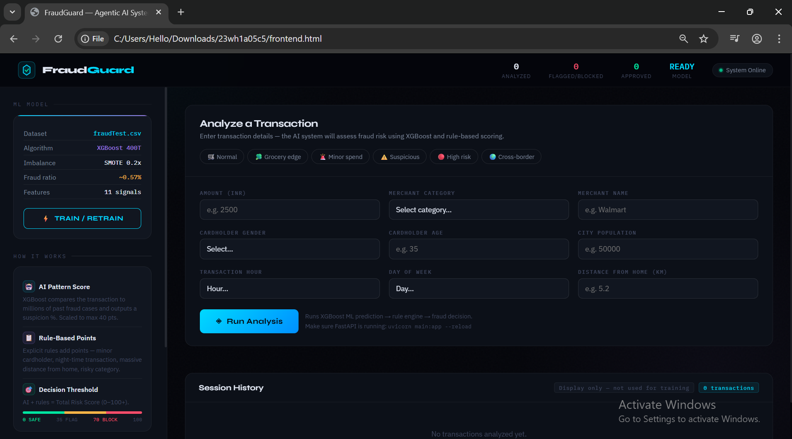

# FraudGuard — Agentic AI Fraud Detection System

> Real-time credit card fraud detection powered by XGBoost ML, a rule-based scoring engine, and an autonomous fraud agent with LLM-powered reasoning.

---

## Overview

FraudGuard is a full-stack agentic AI system that analyzes financial transactions and makes autonomous BLOCK / FLAG / APPROVE decisions. It combines a trained machine learning model with an explainable rule engine and an optional LLM layer (Llama 3 via Ollama) that narrates the reasoning behind each decision.

---

## Architecture

```
┌─────────────────────────────────────────────────────────────────┐
│                       frontend.html                             │
│   Input Form → Preset Scenarios → Results Panel → History Log   │
└────────────────────────┬────────────────────────────────────────┘
                         │ POST /predict
                         ▼
┌─────────────────────────────────────────────────────────────────┐
│                   FastAPI Backend                               │
│                                                                 │
│  ┌──────────────┐    ┌─────────────────┐    ┌───────────────┐  │
│  │  model.py    │───▶│   agent.py      │───▶│  main.py      │  │
│  │  XGBoost     │    │  Rule Engine +  │    │  REST API     │  │
│  │  + SMOTE     │    │  Agent Logic +  │    │  /train       │  │
│  │  + Features  │    │  LLM Reasoning  │    │  /predict     │  │
│  └──────────────┘    └─────────────────┘    └───────────────┘  │
└─────────────────────────────────────────────────────────────────┘
```

---

## Features

- **XGBoost Classifier** trained on 550K+ real-world transactions with SMOTE oversampling for class imbalance — achieves **AUC-ROC ~0.983**
- **Feature Engineering** — log amount, amount-to-category ratio, amount-per-population, haversine distance, hour, weekday, age
- **Agentic Decision Loop** — Think → Act → Log → Explain (4-step agent pipeline)
- **Rule-Based Scoring Engine** — layered risk point system on top of ML probability
- **Hard Safety Rules** — hard-coded overrides (e.g. minor cardholder = instant BLOCK, score 100)
- **LLM Reasoning** — optional Llama 3 explanation of each decision via Ollama
- **Session Memory** — agent logs all decisions in-memory across the session
- **Preset Scenarios** — one-click test cases (Minor spend, Suspicious, High risk, Cross-border)
- **Dark-themed dashboard** — real-time risk bar, factor contribution breakdown, transaction history

---

## Tech Stack

| Layer | Technology |
|---|---|
| Frontend | Vanilla HTML/CSS/JS (single file) |
| Backend | FastAPI + Uvicorn |
| ML Model | XGBoost + scikit-learn + imbalanced-learn (SMOTE) |
| Data | Kaggle Credit Card Fraud Dataset (fraudTest.csv) |
| Agent | Custom Python agent with tool-use pattern |
| LLM | Llama 3 via Ollama (optional, local) |
| Serialization | joblib (.pkl for model, category map, category averages) |

---

## Project Structure

```
FraudGuard/
├── fraud_backend/
│   ├── main.py          # FastAPI app — /train and /predict endpoints
│   ├── model.py         # XGBoost training, feature engineering, prediction
│   ├── agent.py         # Agentic fraud logic — rules, scoring, LLM, memory
│   ├── model.pkl        # Trained XGBoost model (pre-built)
│   ├── category_map.pkl # Category label encoder
│   ├── cat_avg.pkl      # Per-category average amounts
│   └── fraudTest.csv    # Dataset (Kaggle)
└── frontend.html        # Single-file UI dashboard
```

---

## Screenshots

### Dashboard — Transaction Analysis & Risk Output



> The main interface: transaction input form with preset scenarios on the left, real-time risk verdict and factor breakdown on the right.

### BLOCK Decision — High Risk Transaction


> A Rs 8,450 travel transaction at 2 AM with 1,840 km distance earns a risk score of 82.4 — the agent flags it automatically.

### APPROVE Decision — Low Risk Transaction


> A standard grocery transaction with low amount, normal hour, and short distance gets approved with a risk score under 35.

### FLAG Decision — Medium Risk


> Borderline transactions are flagged for human review rather than automatically blocked.

### Risk Factor Contribution Breakdown


> Each factor's individual contribution to the final risk score is surfaced — model signal, amount, distance, time-of-day, and category.

### Transaction History Log


> All analyzed transactions are logged in the session with their decision outcome.

---

## How It Works

### Step 1 — ML Prediction (`model.py`)

The XGBoost classifier takes 11 engineered features and returns a fraud probability between 0 and 1.

**Features used:**
- `amt` — raw transaction amount
- `log_amt` — log-transformed amount
- `amt_to_category_ratio` — amount divided by average for that merchant category
- `amt_per_population` — amount normalized by city population
- `city_pop` — city population
- `hour` — hour of day (0–23)
- `day` — day of week (0–6)
- `age` — cardholder age derived from DOB
- `distance` — haversine distance between cardholder and merchant (km)
- `gender` — binary encoded
- `category` — merchant category label-encoded

### Step 2 — Rule Engine (`agent.py`)

The ML probability seeds the risk score (max 40 points). Rule layers then add additional points:

| Rule | Points |
|---|---|
| Amount > $100,000 | +40 |
| Amount > $50,000 | +30 |
| Amount > $20,000 | +25 |
| Amount > $5,000 | +15 |
| Age < 21 or > 65 | +10 |
| Distance > 2,000 km | +30 |
| Distance > 500 km | +12 |
| Hour between 0–5 AM | +12 |
| Category: travel or misc_net | +15 |
| **Hard Rule: Age ≤ 18** | **BLOCK (score = 100, override)** |

### Step 3 — Agent Decision

```
Score ≥ 70  →  BLOCK  →  block_transaction()
Score ≥ 35  →  FLAG   →  flag_transaction()
Score < 35  →  APPROVE →  approve_transaction()
```

### Step 4 — LLM Explanation (optional)

If Ollama is running locally with Llama 3, the agent sends the decision context to the model and appends a human-readable explanation to the API response.

### Step 5 — Memory

Every decision is appended to `AGENT_MEMORY` (a session-level list) with timestamp, amount, and outcome.

---

## API Reference

### `GET /`
Health check.
```json
{ "message": "FraudGuard backend running 🔥" }
```

### `POST /train`
Trains the XGBoost model on `fraudTest.csv` and saves all artifacts.
```json
{ "status": "Model trained 🚀", "auc": 0.983 }
```

### `POST /predict`

**Request body:**
```json
{
  "amount": 8450.0,
  "city_pop": 45200,
  "hour": 2,
  "day": 6,
  "age": 24,
  "distance": 1840.0,
  "gender": "M",
  "category": "travel"
}
```

**Response:**
```json
{
  "fraud_probability": 0.7621,
  "risk_score": 82.4,
  "decision": "BLOCK",
  "risk_level": "HIGH",
  "recommended_action": "Block transaction",
  "reasons": ["Llama 3 explanation here (if Ollama running)"],
  "contributions": [
    ["Model signal", 22.1],
    ["Amount", 15.0],
    ["Distance", 30.0],
    ["Odd hours", 12.0],
    ["Category", 15.0]
  ]
}
```

---

## Setup & Installation

### Prerequisites

- Python 3.10+
- (Optional) [Ollama](https://ollama.ai) with `llama3` pulled for LLM reasoning

### 1. Clone and install dependencies

```bash
git clone https://github.com/your-username/fraudguard.git
cd fraudguard

pip install fastapi uvicorn xgboost scikit-learn imbalanced-learn pandas numpy joblib requests
```

### 2. Start the backend

```bash
cd fraud_backend
uvicorn main:app --reload --port 8000
```

The API will be live at `http://localhost:8000`.

### 3. Train the model (first run only)

```bash
curl -X POST http://localhost:8000/train
```

This reads `fraudTest.csv`, engineers all features, trains the XGBoost model, and saves `model.pkl`, `category_map.pkl`, and `cat_avg.pkl`.

> **Skip this step** if the `.pkl` files are already included — the pre-trained model is ready to use.

### 4. Open the frontend

Open `frontend.html` directly in your browser. No build step needed.

> Make sure the backend is running on port 8000 — the frontend calls `http://localhost:8000/predict`.

### 5. (Optional) Enable LLM reasoning

```bash
# Install Ollama from https://ollama.ai then:
ollama pull llama3
ollama serve
```

When Ollama is running, each prediction response will include a natural-language explanation from Llama 3.

---

## Dataset

This project uses the [Credit Card Fraud Detection dataset](https://www.kaggle.com/datasets/kartik2112/fraud-detection) from Kaggle (`fraudTest.csv`).

- ~550,000 transactions
- ~0.57% fraud rate (highly imbalanced — handled with SMOTE)
- Features include merchant location, cardholder demographics, timestamp, and transaction amount

---

## Model Performance

Evaluated on a held-out 20% test split with stratified sampling:

| Metric | Value |
|---|---|
| AUC-ROC | ~0.983 |
| Resampling | SMOTE (sampling_strategy=0.2) |
| Estimators | 400 |
| Max Depth | 6 |
| Learning Rate | 0.05 |

---

## Agent Decision Thresholds

| Risk Score | Decision | Risk Level |
|---|---|---|
| 70–100 | BLOCK | HIGH |
| 35–69 | FLAG | MEDIUM |
| 0–34 | APPROVE | LOW |

---
